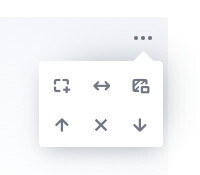

# Simple Image Tool

Provides Image Blocks for the [Editor.js](https://editorjs.io).

Works only with pasted image URLs and requires no server-side uploader.


## Installation

Get the package

```shell
yarn add @editorjs/simple-image
```

Include module at your application

```javascript
import SimpleImage from "@editorjs/simple-image";
```

Optionally, you can load this tool from CDN [JsDelivr CDN](https://cdn.jsdelivr.net/npm/@editorjs/simple-image)


## Usage

Add a new Tool to the `tools` property of the Editor.js initial config.

```javascript
var editor = EditorJS({
  ...

  tools: {
    ...
    image: SimpleImage,
  }

  ...
});
```

## Config Params

This Tool has no config params

## Tool's settings



1. Add border

2. Stretch to full-width

3. Add background

## Output data

| Field          | Type      | Description                     |
| -------------- | --------- | ------------------------------- |
| url            | `string`  | image's url                     |
| caption        | `string`  | image's caption                 |
| withBorder     | `boolean` | add border to image             |
| withBackground | `boolean` | need to add background          |
| stretched      | `boolean` | stretch image to screen's width |

```json
{
  "type": "image",
  "data": {
    "url": "https://www.tesla.com/tesla_theme/assets/img/_vehicle_redesign/roadster_and_semi/roadster/hero.jpg",
    "caption": "Roadster // tesla.com",
    "withBorder": false,
    "withBackground": false,
    "stretched": true
  }
}
```
